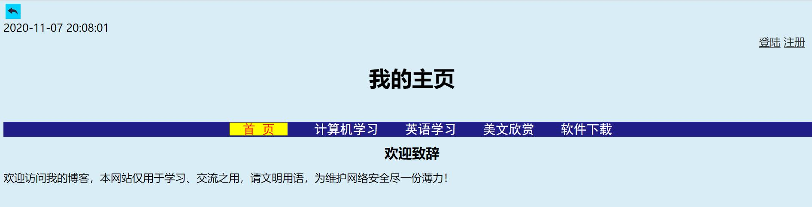
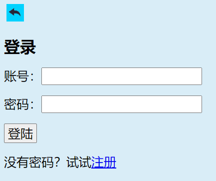
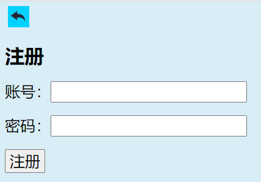

# 网页简介
本网站是小作者创作的第一个网站，主要包括计算机学习、英语学习、校园生活、相册、论坛交流等内容，用于交流和学习，后续还会不断更新和完善，欢迎大家浏览查阅并提出宝贵意见，请文明用语！
## 作者简介
本网站小作者王浩宇，今年九岁，酷爱编程，已学习Python编程一年多。经反复修改编辑得以完成本网站，虽不甚完善，但作者也付出了辛勤的汗水，希望大家多多鼓励支持，相信不久的将来定会取得更大的成就！
## 网页欣赏

----

----
